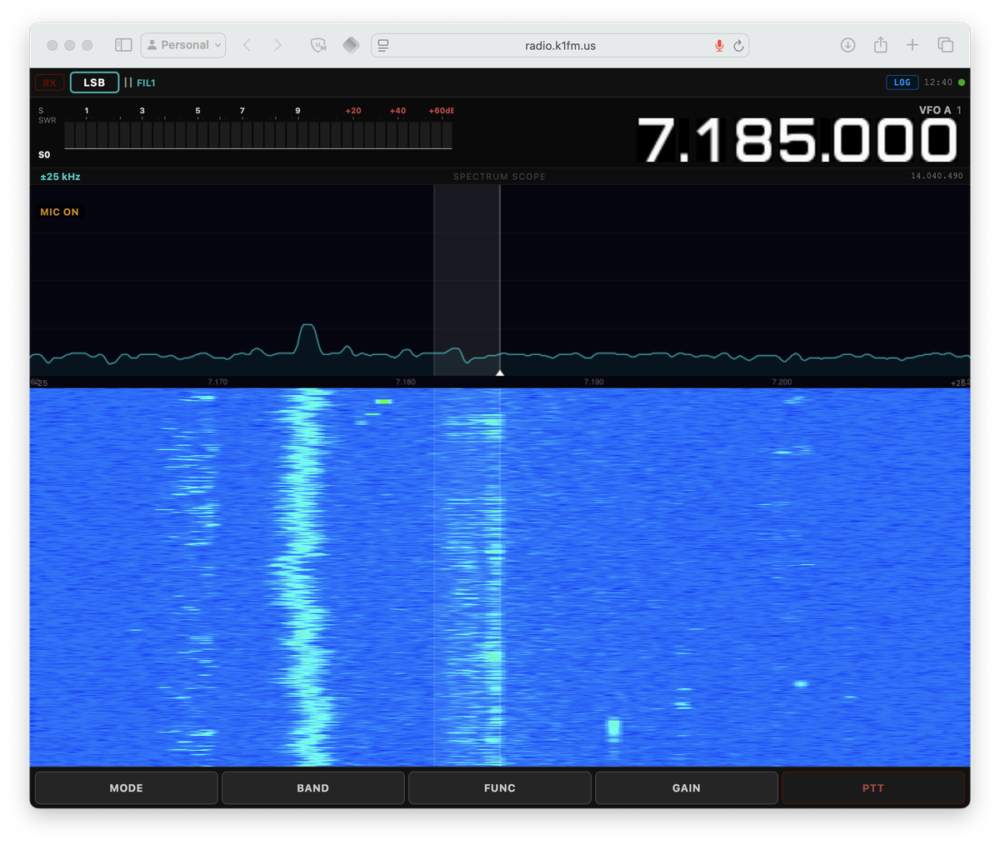
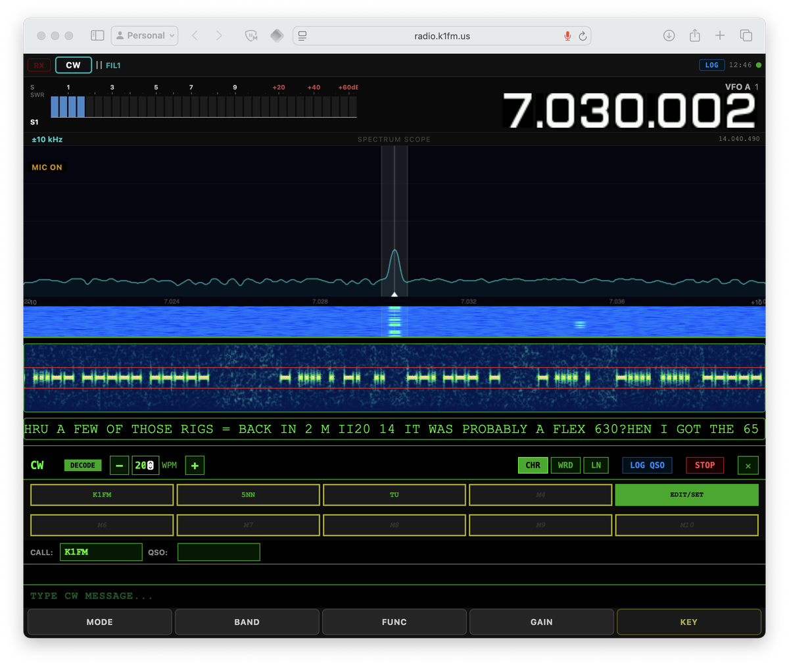
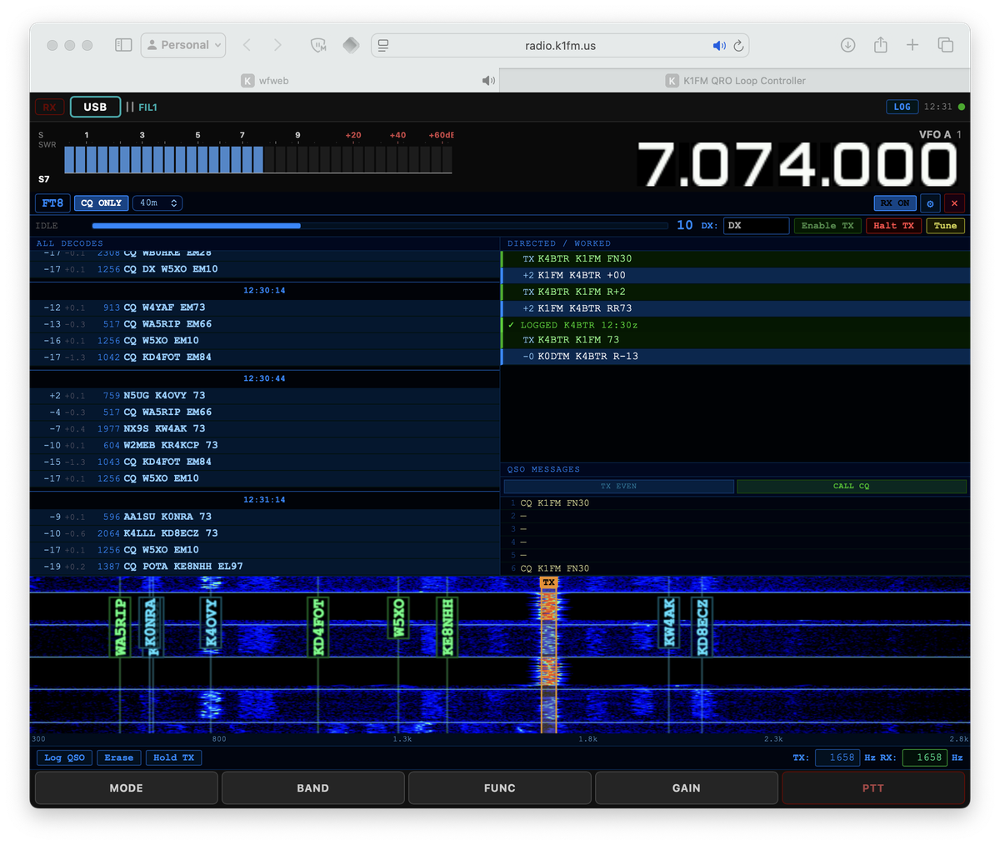

# wfweb

**wfweb** is a fork of [wfview](https://gitlab.com/eliggett/wfview) that adds a built-in web interface for browser-based remote control and real-time audio streaming. It is aimed at users who want to operate their radio from a phone, tablet, or any browser — without installing any client software.

---

## About wfview

wfview is an outstanding open-source front-end for Icom, Kenwood, and Yaesu amateur radio transceivers. Written in C++/Qt by Elliott H. Liggett W6EL, Phil E. Taylor M0VSE, and contributors, it provides a rich desktop GUI with waterfall display, full radio control, audio over LAN, rigctld emulation, and much more. It is one of the most capable and well-engineered radio control applications available for Linux, macOS, and Windows.

The wfview project is hosted on GitLab:
**https://gitlab.com/eliggett/wfview**

Since wfview is on GitLab and wfweb is on GitHub, GitHub's native fork mechanism cannot be used. This repository is a maintained fork that tracks upstream wfview and adds the web interface layer on top.

---

## What wfweb adds

| Feature | wfview | wfweb |
|---|:---:|:---:|
| Desktop GUI (Qt) | ✓ | ✓ |
| Full radio control (CI-V, LAN) | ✓ | ✓ |
| Waterfall display | ✓ | ✓ |
| Audio over LAN | ✓ | ✓ |
| Built-in HTTP/WebSocket server | — | ✓ |
| Browser-based remote control | — | ✓ |
| Browser RX audio streaming | — | ✓ |
| Browser TX audio (mic to rig) | — | ✓ |
| CW decoder (ggmorse / Goertzel) | — | ✓ |
| FT8/FT4 DIGI panel (full QSO) | — | ✓ |
| Mobile-responsive UI | — | ✓ |
| Headless / no-display operation | — | ✓ |

## Getting started

Plug in your radio, run one command, open a browser. That's it.

### IC-7300 (USB)

Zero configuration. Connect the radio via USB and run:

```bash
./wfweb
```

Open `https://<host>:8080` in your browser. Accept the self-signed certificate warning. You're on the air.

### IC-7300 Mk2 (USB)

The Mk2 uses a different CI-V address. One extra flag:

```bash
./wfweb --civ 130
```

### IC-7300 Mk2 (Ethernet)

The Mk2 has a built-in Ethernet port — no USB cable needed:

```bash
./wfweb --lan 192.168.1.100 --civ 130 --lan-user admin --lan-pass secret -S
```

Replace the IP, username, and password with your radio's settings. The `-S` flag disables the built-in rig server (not needed when connecting to a radio directly over LAN).

### IC-7610 (USB)

```bash
./wfweb --civ 152
```

### IC-7610 (Ethernet)

```bash
./wfweb --lan 192.168.1.100 --civ 152 --lan-user admin --lan-pass secret -S
```

> For other radios, see the [CI-V address table](#other-radios) and [command-line options](#command-line-options) below.

---

## Screenshots







The web interface is served directly by the `wfweb` binary over HTTPS (self-signed certificate). No separate web server is needed. Connect your radio, run `wfweb`, and open `https://<host>:8080` in any browser. On first visit, accept the browser's certificate warning.

---

## Quick start (headless, IC-7300 via USB)

The IC-7300 connected via USB is the primary tested configuration. No configuration file is needed — just install and run:

```bash
wfweb
```

Open your browser at `https://<host>:8080`. On first visit, accept the browser's self-signed certificate warning.

wfweb will detect the IC-7300 automatically (CI-V address 0x94, baud 115200, port auto-detected).

### LAN connection (no config file needed)

If your radio (or a wfview server) is reachable over the network, you can connect entirely from the command line:

```bash
wfweb --lan 192.168.1.100 --lan-user admin --lan-pass secret -S
```

This enables LAN/UDP mode, connects to the given IP with default Icom ports (50001–50003), and disables the built-in rig server (`-S`) to avoid port conflicts. All parameters have sensible defaults — only `--lan` is required to enable LAN mode.

### Other radios

For radios other than the IC-7300, you can either pass CLI flags or create a configuration file.

#### CLI example (IC-705 via LAN)

```bash
wfweb --lan 192.168.1.100 --civ 164 --lan-user admin -S
```

#### Config file

Create a `.ini` file and pass it with `-s`. The `[Program]` section tells wfweb to skip the first-time setup dialog; the `[Radio]` section identifies the rig.

> **Note:** Only the IC-7300 via USB has been tested. The settings below are derived from CI-V documentation and are provided as a starting point — use at your own risk and please report results.

#### IC-7300 Mk2 (USB)

```ini
[Program]
hasRunSetup=true

[Radio]
Manufacturer=0
RigCIVuInt=130
SerialPortRadio=auto
SerialPortBaud=115200
```

#### IC-7300 Mk2 (Ethernet / LAN)

```ini
[Program]
hasRunSetup=true

[Radio]
Manufacturer=0
RigCIVuInt=130

[LAN]
EnableLAN=true
IPAddress=192.168.1.100
ControlLANPort=50001
SerialLANPort=50002
AudioLANPort=50003
Username=admin
Password=
```

Replace `192.168.1.100` with your radio's (or wfview server's) IP address. `Username` and `Password` match the credentials configured on the remote end. Ports 50001–50003 are the defaults and normally do not need to be changed.

Or equivalently, without a config file:

```bash
wfweb --lan 192.168.1.100 --civ 130 --lan-user admin -S
```

#### IC-705 (USB)

```ini
[Program]
hasRunSetup=true

[Radio]
Manufacturer=0
RigCIVuInt=164
SerialPortRadio=auto
SerialPortBaud=115200
```

#### IC-7610 (USB)

```ini
[Program]
hasRunSetup=true

[Radio]
Manufacturer=0
RigCIVuInt=152
SerialPortRadio=auto
SerialPortBaud=115200
```

#### IC-9700 (USB)

```ini
[Program]
hasRunSetup=true

[Radio]
Manufacturer=0
RigCIVuInt=162
SerialPortRadio=auto
SerialPortBaud=115200
```

#### IC-7100 (USB)

```ini
[Program]
hasRunSetup=true

[Radio]
Manufacturer=0
RigCIVuInt=136
SerialPortRadio=auto
SerialPortBaud=115200
```

#### IC-7410 (USB)

```ini
[Program]
hasRunSetup=true

[Radio]
Manufacturer=0
RigCIVuInt=128
SerialPortRadio=auto
SerialPortBaud=115200
```

CI-V addresses are listed in decimal (`RigCIVuInt`). If your radio has been configured with a non-default CI-V address, use that value instead. The default CI-V addresses for each model are:

| Radio | CI-V (hex) | CI-V (decimal) |
|---|:---:|:---:|
| IC-7300 | 0x94 | 148 |
| IC-7300 Mk2 | 0x82 | 130 |
| IC-705 | 0xA4 | 164 |
| IC-7610 | 0x98 | 152 |
| IC-9700 | 0xA2 | 162 |
| IC-7100 | 0x88 | 136 |
| IC-7410 | 0x80 | 128 |

### Key configuration parameters

| Key | Section | Description | Example |
|---|---|---|---|
| `hasRunSetup` | `[Program]` | Skip first-time setup dialog | `true` |
| `Manufacturer` | `[Radio]` | 0=Icom, 1=Kenwood, 2=Yaesu | `0` |
| `RigCIVuInt` | `[Radio]` | CI-V address (decimal) | `148` |
| `SerialPortRadio` | `[Radio]` | Serial port, or `auto` | `/dev/ttyUSB0` |
| `SerialPortBaud` | `[Radio]` | Baud rate | `115200` |
| `AudioOutput` | `[LAN]` | **Optional.** Local server audio output device. Omit for browser-only use. | `hw:CARD=CODEC,DEV=0` |
| `AudioInput` | `[LAN]` | **Optional.** Local server audio input device. Omit for browser-only use. | `hw:CARD=CODEC,DEV=0` |

> Audio streams directly between the radio and the browser — no server-side audio configuration is needed for web operation. `AudioOutput`/`AudioInput` only affect playback and capture on the server machine itself. Use `aplay -l` / `arecord -l` to list ALSA devices if needed.

### Command-line options

All settings-file parameters can be overridden from the command line. Run `wfweb --help` for the full list:

| Flag | Description | Default |
|---|---|---|
| `-s --settings <file>` | Settings .ini file | `~/.config/wfview/wfweb.conf` |
| `-p --port <port>` | Web server HTTPS port | `8080` |
| `-S --no-server` | Disable built-in rig server | server enabled |
| `--lan <ip>` | Connect via LAN/UDP to IP (enables LAN mode) | USB serial |
| `--lan-control <port>` | LAN control port | `50001` |
| `--lan-serial <port>` | LAN serial/CI-V port | `50002` |
| `--lan-audio <port>` | LAN audio port | `50003` |
| `--lan-user <user>` | LAN username | (empty) |
| `--lan-pass <pass>` | LAN password | (empty) |
| `--civ <addr>` | CI-V address (decimal) | auto-detect |
| `--manufacturer <id>` | 0=Icom, 1=Kenwood, 2=Yaesu | `0` (Icom) |
| `-l --logfile <file>` | Log to file | `/tmp/wfweb-*.log` |
| `-b --background` | Run as daemon (Linux/macOS) | foreground |
| `-d --debug` | Enable debug logging | off |

CLI flags override values from the settings file. Passing `--lan` is sufficient to enable LAN mode with default ports; all other LAN flags are optional.

---

## Docker

A multi-arch Docker image is available for `linux/amd64` and `linux/arm64`.

### Using the pre-built image

```bash
docker run --rm -it \
  --device /dev/ttyUSB0 \
  -p 8080:8080 -p 8081:8081 \
  k1fm/wfweb:latest
```

Pass any CLI flags after the image name:

```bash
docker run --rm -it \
  --device /dev/ttyUSB0 \
  -p 8080:8080 -p 8081:8081 \
  k1fm/wfweb:latest --civ 130
```

For LAN-connected radios (no USB device needed):

```bash
docker run --rm -it \
  -p 8080:8080 -p 8081:8081 \
  k1fm/wfweb:latest --lan 192.168.1.100 --lan-user admin --lan-pass secret -S
```

### Building locally

```bash
docker build -f docker/Dockerfile -t wfweb .
docker run --rm -it --device /dev/ttyUSB0 -p 8080:8080 -p 8081:8081 wfweb
```

---

## Building from source

### Dependencies

| Library | Version | License | Purpose |
|---|---|---|---|
| Qt5 | ≥ 5.12 | LGPLv3 | Application framework, UI, networking |
| Qt5 WebSockets | same | LGPLv3 | WebSocket server for web interface |
| libopus | any | BSD 3-Clause | Audio codec for LAN streaming |
| libportaudio | any | MIT | Cross-platform audio I/O |
| libpulse | any | LGPLv2.1 | PulseAudio support (Linux) |
| librtaudio | any | MIT | Cross-platform audio (non-Linux) |
| libhidapi | any | BSD/GPLv3 | USB HID for gamepad controllers |
| QCustomPlot | 2.x | GPLv3 | Waterfall and spectrum plots |
| Speex resampler | any | BSD 3-Clause | Audio sample rate conversion |
| Eigen | 3.x | MPL2 | Linear algebra (CW decoder) |
| ggmorse | any | MIT | Morse code decoding (compiled to WebAssembly for the web frontend) |
| openssl | any | Apache-2.0 | **Runtime only:** generates the self-signed TLS certificate on first launch, required for HTTPS and browser microphone access |

Clone the repository and run `qmake wfweb.pro && make -j$(nproc)`.

---

## License

wfweb is licensed under the **GNU General Public License v3.0**, the same as wfview. As a derivative work, this is required.

See [LICENSE](LICENSE) for the full text.

All third-party components retain their original licenses:
- Qt5 components are used under the LGPLv3 — wfweb links dynamically and makes no modifications to Qt itself.
- QCustomPlot is used under GPLv3, compatible with this project.
- ft8ts is used under GPLv3, compatible with this project.
- Speex resampler, libopus, libportaudio, librtaudio, Eigen: see their respective notices in `src/audio/resampler/` and the About box in the application.
- ggmorse is used under the MIT license.

---

## Upstream relationship

wfweb tracks the upstream wfview `master` branch. The intent is to keep the delta small so that merging upstream improvements remains straightforward. Changes in wfweb are limited to:

- `src/webserver.cpp` / `include/webserver.h` — web server implementation
- `resources/web/` — web frontend (HTML/CSS/JS)
- `resources/web.qrc` — Qt resource file for the web frontend
- Minor changes to `src/wfmain.cpp` for web server initialization
- `wfweb.pro` — headless build producing the `wfweb` binary
- This README and branding strings

---

## Disclaimer

wfweb is provided "as is", without warranty of any kind. See the [LICENSE](LICENSE) for full terms.

This software is intended for use by licensed amateur radio operators in accordance with the regulations of their country. The user is solely responsible for ensuring that their operation complies with all applicable laws and licence conditions, including but not limited to permitted frequencies, power levels, and modes of operation. The authors accept no liability for unlicensed or non-compliant use.

---

## Credits

Full credit for the radio control engine, audio subsystem, waterfall, and everything else that makes this software work goes to the wfview authors and contributors:

- Elliott H. Liggett, W6EL
- Phil E. Taylor, M0VSE
- Roeland Jansen, PA3MET
- Jim Nijkamp, PA8E
- And the entire wfview community

Please consider supporting the original project at **https://wfview.org** and **https://www.patreon.com/wfview**.

The FT8/FT4 DIGI panel is powered by **ft8ts**, a pure-TypeScript FT8/FT4 encoder/decoder by e04:
**https://github.com/e04/ft8ts**

The CW decoder uses **ggmorse**, a Morse code decoding library by Georgi Gerganov:
**https://github.com/ggerganov/ggmorse**
