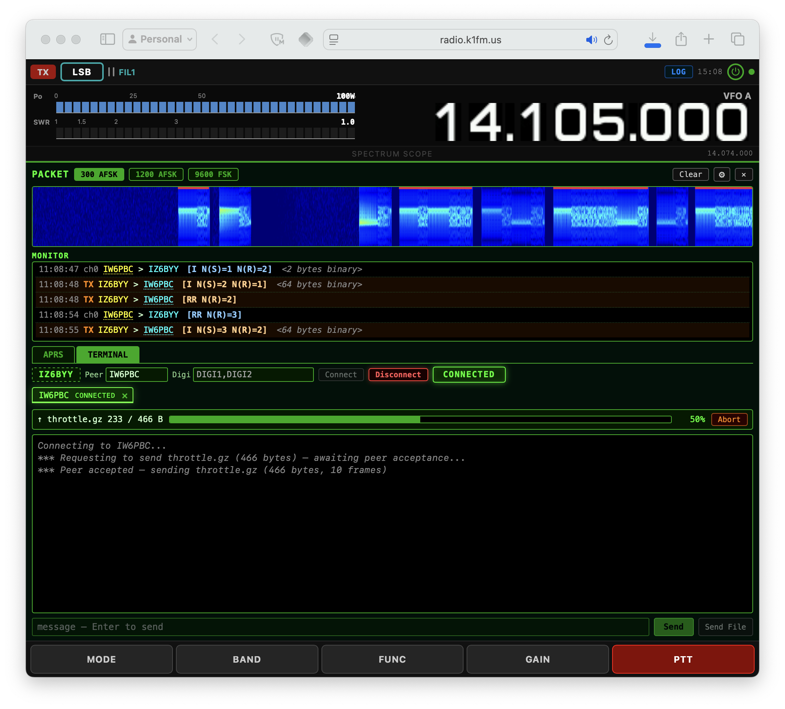

# wfweb

**Control your Icom radio from any browser — phone, tablet, or desktop.**

wfweb turns your transceiver into a web-accessible station. Waterfall, SSB, CW decoding, FT8/FT4, [FreeDV digital voice](https://youtu.be/AWdHcyiOOnY), RADE, and AX.25 packet (APRS, connected QSOs, file transfer) — all in the browser, no client software required.




---

## What wfweb adds over wfview

wfweb is a fork of [wfview](https://gitlab.com/eliggett/wfview), the outstanding open-source front-end for Icom, Kenwood, and Yaesu transceivers by Elliott H. Liggett W6EL, Phil E. Taylor M0VSE, and contributors.

Everything wfview does, wfweb does too — plus a built-in web interface:

| Feature | wfview | wfweb |
|---|:---:|:---:|
| Desktop GUI (Qt) | ✓ | ✓ |
| Full radio control (CI-V, LAN) | ✓ | ✓ |
| Waterfall display | ✓ | ✓ |
| Audio over LAN | ✓ | ✓ |
| Built-in HTTP/WebSocket server | — | ✓ |
| Browser-based remote control | — | ✓ |
| Browser RX audio streaming | — | ✓ |
| Browser TX audio (mic to rig) | — | ✓ |
| CW decoder (ggmorse / Goertzel) | — | ✓ |
| FT8/FT4 DIGI panel (full QSO) | — | ✓ |
| RADE (Radio Autoencoder) | — | ✓ |
| FreeDV digital voice (700D/700E/1600) | — | ✓ |
| AX.25 packet — 300/1200/9600, APRS, terminal, YAPP | — | ✓ |
| Mobile-responsive UI | — | ✓ |
| Headless / no-display operation | — | ✓ |

---

## Getting started

There are three ways to run wfweb. Pick the one that matches your setup:

1. [**Native build, USB radio**](#1-native-build--usb-radio) — any supported Icom connected by USB cable (most common)
2. [**Native build, LAN radio**](#2-native-build--lan-radio) — radios with built-in Ethernet (e.g. IC-7300 Mk2, IC-9700) or a LAN accessory
3. [**Docker**](#3-docker) — zero-install, multi-arch image for either USB or LAN radios

In every case, once wfweb is running you open `https://<host>:8080` in your browser and accept the self-signed certificate warning.

### 1. Native build — USB radio

Download a pre-built binary from [GitHub Releases](../../releases) for your platform, plug in your radio, and run:

```bash
./wfweb
```

That's it — any supported Icom (IC-7300, IC-7300 Mk2, IC-7610, IC-705, IC-9700, IC-7100, IC-7410) is auto-detected over USB at its default CI-V address.

If you've changed your radio's CI-V address to something non-standard, pass it explicitly:

```bash
./wfweb --civ 0x94   # hex (as shown on the radio), or decimal (148)
```

### 2. Native build — LAN radio

For Icoms with a built-in Ethernet port (IC-7300 Mk2, IC-9700, IC-7610, …) or a LAN accessory, specify the IP and credentials on the command line:

```bash
./wfweb --lan 192.168.1.100 --lan-user admin --lan-pass secret
```

Replace the IP and credentials with your radio's settings. If your radio uses a non-default CI-V address, add `--civ 0x<addr>`.

### 3. Docker

No build, no dependencies. The image `k1fm/wfweb` is multi-arch (`linux/amd64` and `linux/arm64`) — it runs on x86 servers, Raspberry Pi, and everything in between.

**LAN radio (e.g. IC-7300 Mk2 via Ethernet):**

```bash
docker run --rm -it \
  -p 8080:8080 -p 8081:8081 \
  k1fm/wfweb --lan 192.168.1.100 --lan-user admin --lan-pass secret
```

**USB radio** (share the serial device and sound subsystem with the container):

```bash
docker run --rm -it \
  --device /dev/ttyUSB0 \
  --device /dev/snd --group-add audio \
  -p 8080:8080 -p 8081:8081 \
  k1fm/wfweb
```

See [Docker details](#docker-details) below for USB audio, custom serial ports, and building the image locally.

---

## Downloads

Pre-built binaries are published on [GitHub Releases](../../releases):

| Platform | Package | Distro |
|---|---|---|
| **Linux x86_64** | `.deb` (ubuntu2404) | Ubuntu 24.04 Noble |
| **Linux x86_64** | `.deb` (debian12) | Debian 12 Bookworm |
| **Linux x86_64** | `.deb` (debian13) | Debian 13 Trixie |
| **Linux ARM64 / Raspberry Pi** | `.deb` (ubuntu2404) | Ubuntu 24.04 Noble |
| **Linux ARM64 / Raspberry Pi** | `.deb` (debian12) | Raspberry Pi OS Bookworm / Debian 12 |
| **Linux ARM64 / Raspberry Pi** | `.deb` (debian13) | Raspberry Pi OS Trixie / Debian 13 |
| **macOS** | zip | Apple Silicon |
| **Windows** | zip | x86_64 |

> **Which `.deb` do I need?** The tag in the filename tells you:
> **ubuntu2404** for Ubuntu 24.04,
> **debian12** for Debian 12 Bookworm and Raspberry Pi OS Bookworm,
> **debian13** for Debian 13 Trixie and Raspberry Pi OS Trixie.
> Each is built natively on its target distro so the library dependencies match.

---

## FreeDV and RADE digital voice

wfweb is the first web-based transceiver interface with built-in [FreeDV](https://freedv.org/) support. Operate FreeDV digital voice modes directly from your browser — no additional software needed on the client side.

All FreeDV processing happens **server-side**: the server encodes and decodes modem tones in real time, so browser clients send and receive normal speech audio while the radio transmits and receives FreeDV signals over SSB.

### Supported modes

| Mode | Type | Description |
|------|------|-------------|
| **RADE** | Radio Autoencoder | Next-generation ML-based codec using neural network inference for high-quality low-bitrate voice over HF |
| **700D** | Classic FreeDV | Proven HF digital voice, OFDM modem, works well on noisy channels |
| **700E** | Classic FreeDV | Improved 700D variant with better performance on fast-fading channels |
| **1600** | Classic FreeDV | Original FreeDV mode, FDM modem, robust on clean channels |

### How it works

```
RX:  Radio (modem tones) → FreeDV/RADE decode → speech audio → browser
TX:  Browser (speech) → FreeDV/RADE encode → modem tones → radio (SSB)
```

Select the FreeDV mode from the web UI, key up, and talk — wfweb handles the rest.

### Performance

RADE uses real-time neural network inference. Expect roughly **40% CPU usage** on a mid-range laptop (e.g. Intel i5-10310U @ 1.70 GHz). The classic FreeDV modes (700D/700E/1600) are much lighter and run comfortably on a Raspberry Pi.

---

## AX.25 packet — APRS, connected QSOs, and file transfer

A complete browser-based packet station: AX.25 frame monitor, connected-mode QSOs, APRS, and YAPP file transfer — no separate TNC, KISS bridge, or APRS client.

### What's included

| Capability | Details |
|------------|---------|
| **Demodulators** | 300 baud AFSK • 1200 baud AFSK • 9600 baud G3RUH FSK |
| **Monitor** | Live AX.25 decode with sender, receiver, digipeater path, control field, and PID |
| **APRS** | Heard-stations table and beacon compose |
| **Terminal** | Connected-mode QSO to a peer station — chat, message-on-Enter |
| **File transfer** | YAPP send/receive over an established AX.25 connection |
| **Waterfall** | Live RX spectrogram (FT8-style palette) with TX bursts marked in red |

### How it works

```
RX:  Radio (audio) → Direwolf demod → AX.25 stack → frames to browser
TX:  Browser (frame, beacon, file) → AX.25 → Direwolf modem → SSB/FM mic to radio
```

Packet runs entirely server-side using a built-in [Direwolf](https://github.com/wb2osz/direwolf) modem. The browser renders the waterfall, displays the monitor, and exposes the APRS / Terminal tabs; the radio just sees a normal voice carrier.

Tune to a packet frequency in a voice mode (LSB/USB/FM/AM), open the **Packet** panel, pick the demodulator, and frames stream into the monitor as they decode. To open a connected QSO type the peer call, optional digipeater path, and press **Connect** — once `CONNECTED` shows you can send messages or push files via YAPP.

The shared station callsign (gear dialog) is reused across CW, FT8/FT4, FreeDV reporter, APRS, and the AX.25 link, so you set it once and every mode uses it.

---

## Command-line options

All settings can be passed as CLI flags. Run `wfweb --help` for the full list.

| Flag | Description | Default |
|---|---|---|
| `-s --settings <file>` | Settings .ini file | `~/.config/wfview/wfweb.conf` |
| `-p --port <port>` | Web server HTTPS port | `8080` |
| `-S --no-web` | Disable web server, enable rig server | web server enabled |
| `--lan <ip>` | Connect via LAN/UDP (enables LAN mode) | USB serial |
| `--lan-control <port>` | LAN control port | `50001` |
| `--lan-serial <port>` | LAN serial/CI-V port | `50002` |
| `--lan-audio <port>` | LAN audio port | `50003` |
| `--lan-user <user>` | LAN username | (empty) |
| `--lan-pass <pass>` | LAN password | (empty) |
| `--civ <addr>` | CI-V address (hex `0x94` or decimal `148`) | auto-detect (USB only) |
| `--manufacturer <id>` | 0=Icom, 1=Kenwood, 2=Yaesu | `0` (Icom) |
| `-l --logfile <file>` | Log to file | `/tmp/wfweb-*.log` |
| `-b --background` | Run as daemon (Linux/macOS) | foreground |
| `-c --clearconfig CONFIRM` | Reset all saved settings and exit | — |
| `-d --debug [file]` | Enable verbose debug logging (optionally to file) | off |

### About `--settings`

Most users never need this flag. wfweb normally stores **your** preferences (serial port, audio device, web-server port, LAN address and credentials, per-radio config, etc.) in the OS default location under your user profile. `--settings` just lets you point it somewhere else instead.

The file is created and managed by wfweb — you don't hand-write it. You edit settings through the web UI and wfweb persists them to whichever file you named.

**Common reasons to use `--settings`:**

- **Running multiple wfweb instances in parallel, one per radio.** Give each its own `--settings` file so they don't overwrite each other's config.
- **Docker or systemd deployments** where the default per-user location is inconvenient. Mount or install a config at a fixed, predictable path (e.g. `/etc/wfweb/station.ini`).
- **Named profiles** you can switch between or back up: `home.ini`, `contest.ini`, `portable.ini`, etc.

To create a fresh settings file, just run:

```bash
wfweb -s ./my-profile.ini
```

wfweb writes a file with sensible defaults on first run. After that, open the web UI and configure as usual — your changes are saved back to that file.

If all you need is to talk to a rig on a non-default CI-V address or a different manufacturer, you don't need `--settings` at all — use `--civ <addr>` and `--manufacturer <id>` directly.

> **Note:** `--settings` does **not** take `.rig` files. Those are CI-V command dictionaries for specific radio models that wfweb already loads automatically from its install's `rigs/` directory based on the radio it detects on the bus. You should never pass one on the command line.

### Debug logging

When reporting a bug, run wfweb with `--debug` and a log file to capture verbose diagnostics:

```bash
wfweb --debug /tmp/wfweb-debug.log --lan 192.168.1.100 --lan-user myuser --lan-pass mypass
```

This produces detailed, timestamped logs covering power on/off state transitions, VFO/split routing decisions, CI-V command traffic, and cache updates. Reproduce the issue, then share the log file with your bug report.

Without the filename argument, `--debug` writes to the default log location (`/tmp/wfweb-*.log`).

---

## Docker details

The [Getting started](#3-docker) section covers the common cases. These are extras.

### Custom serial port

```bash
docker run --rm -it \
  --device /dev/ttyUSB1 \
  -p 8080:8080 -p 8081:8081 \
  k1fm/wfweb --serial-port /dev/ttyUSB1
```

### IC-7300 (original) via USB on Linux with radio USB audio

The original IC-7300 connects via USB, which provides both a serial port and a USB audio codec. To route TX/RX audio through the radio, pass the serial device, the sound subsystem, and the `--audio-device` flag:

```bash
docker run --rm -it \
  --device /dev/ttyUSB1 \
  --device /dev/snd --group-add audio \
  -p 8080:8080 -p 8081:8081 \
  k1fm/wfweb --serial-port /dev/ttyUSB1 --audio-device 'USB Audio CODEC'
```

Adjust `/dev/ttyUSB1` to match your system (`ls /dev/ttyUSB*` to find it).

### Building the image locally

```bash
docker build -f docker/Dockerfile -t wfweb .
docker run --rm -it --device /dev/ttyUSB0 -p 8080:8080 -p 8081:8081 wfweb
```

---

## Configuration file

For persistent configuration, create an `.ini` file and pass it with `-s`:

```ini
[Program]
hasRunSetup=true

[Radio]
Manufacturer=0
RigCIVuInt=130
SerialPortRadio=auto
SerialPortBaud=115200
```

For LAN connections:

```ini
[Program]
hasRunSetup=true

[Radio]
Manufacturer=0
RigCIVuInt=130

[LAN]
EnableLAN=true
IPAddress=192.168.1.100
ControlLANPort=50001
SerialLANPort=50002
AudioLANPort=50003
Username=admin
Password=
```

### Key configuration parameters

| Key | Section | Description | Example |
|---|---|---|---|
| `hasRunSetup` | `[Program]` | Skip first-time setup dialog | `true` |
| `Manufacturer` | `[Radio]` | 0=Icom, 1=Kenwood, 2=Yaesu | `0` |
| `RigCIVuInt` | `[Radio]` | CI-V address (decimal) | `148` |
| `SerialPortRadio` | `[Radio]` | Serial port, or `auto` | `/dev/ttyUSB0` |
| `SerialPortBaud` | `[Radio]` | Baud rate | `115200` |
| `AudioOutput` | `[LAN]` | Local server audio output device (optional) | `hw:CARD=CODEC,DEV=0` |
| `AudioInput` | `[LAN]` | Local server audio input device (optional) | `hw:CARD=CODEC,DEV=0` |

> Audio streams directly between the radio and the browser — no server-side audio configuration is needed for web operation.

---

## Building from source

See **[BUILDING.md](BUILDING.md)** for platform-specific prerequisites and build instructions (Linux, macOS, Windows).

---

## Upstream relationship

wfweb tracks upstream wfview `master`. The delta is kept small — changes are limited to the web server, web frontend, headless build config, and this README. See the [wfview project](https://gitlab.com/eliggett/wfview) for the core radio engine.

---

## Credits

Full credit for the radio control engine, audio subsystem, waterfall, and everything else that makes this work goes to the wfview authors and contributors:

- Elliott H. Liggett, W6EL
- Phil E. Taylor, M0VSE
- Roeland Jansen, PA3MET
- Jim Nijkamp, PA8E
- And the entire wfview community

Please support the original project at **https://wfview.org** and **https://www.patreon.com/wfview**.

The FT8/FT4 DIGI panel is powered by [ft8ts](https://github.com/e04/ft8ts) by e04.
The CW decoder uses [ggmorse](https://github.com/ggerganov/ggmorse) by Georgi Gerganov.
FreeDV digital voice uses [codec2](https://github.com/drowe67/codec2) by David Rowe VK5DGR and contributors, and [radae_nopy](https://github.com/peterbmarks/radae_nopy) by Peter Marks VK5APM (a standalone C implementation of the RADE Radio Autoencoder).
AX.25 packet — modems, framing, link control, APRS, and YAPP — is powered by [Direwolf](https://github.com/wb2osz/direwolf) by John Langner WB2OSZ.

---

## License

GNU General Public License v3.0 — see [LICENSE](LICENSE).

All third-party components retain their original licenses — see [THIRD_PARTY_LICENSES](THIRD_PARTY_LICENSES) for the full text of each.

---

## Disclaimer

This software is provided "as is", without warranty of any kind. It is intended for use by licensed amateur radio operators in compliance with their country's regulations. The authors accept no liability for unlicensed or non-compliant use.
